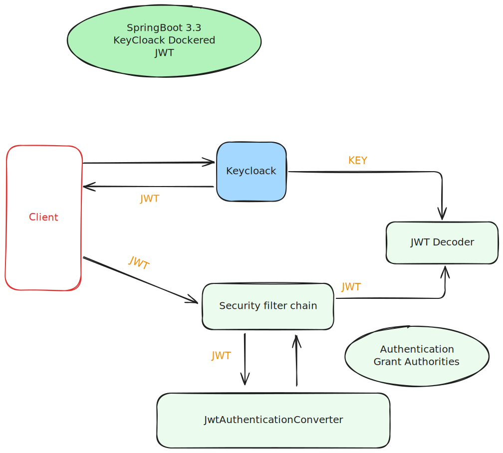

- IMAPI Angular service: https://github.com/Kolman-Freecss/kf-imapi-angular
- IMAPI Incident Service: https://github.com/Kolman-Freecss/kf-imapi-incident-service
- IMAPI Response Team Service: https://github.com/Kolman-Freecss/kf-imapi-response-service
- IMAPI Notification Service: https://github.com/Kolman-Freecss/kf-imapi-notification-service
- IMAPI Authentication Gateway Service: https://github.com/Kolman-Freecss/kf-imapi-auth-gateway
- IMAPI DevOps / Kafka Event Handling: https://github.com/Kolman-Freecss/kf-imapi-devops

## Brief Description

Features: 
- Implementation of security using Spring Boot 3.0 and Keycloack with JSON Web Tokens (JWT).
- API Gateway for routing requests to the appropriate service.
- SSO (Single Sign-On) using Keycloack.
- OAuth2 Protocol.

## Getting Started

- Configure Keycloack with the following settings:
  - New Realm: `imapi`
  - Client: `imapi-gateway`
    - Client ID: `imapi-gateway`
  - 2 Roles: `USER` and `ADMIN`
  - 2 Users: `user` and `admin`
    - Password: `password`
    - Map Roles to the users: `USER` and `ADMIN`

**Diagram Flow:**

## Tech stack:

- Spring Boot 3.0
- Keycloack
- JSON Web Tokens (JWT)
- Maven
- Docker

---

Shield: [![CC-BY-NC-ND 4.0][CC-BY-NC-ND-shield]][CC-BY-NC-ND]

This work is licensed under a [Creative Commons Attribution-NonCommercial-NoDerivatives 4.0 International License.][CC-BY-NC-ND]

[![CC-BY-NC-ND 4.0][CC-BY-NC-ND-image]][CC-BY-NC-ND]

[CC-BY-NC-ND-shield]: https://img.shields.io/badge/License-CC--BY--NC--ND--4.0-lightgrey
[CC-BY-NC-ND]: http://creativecommons.org/licenses/by-nc-nd/4.0/
[CC-BY-NC-ND-image]: https://i.creativecommons.org/l/by-nc-nd/4.0/88x31.png
